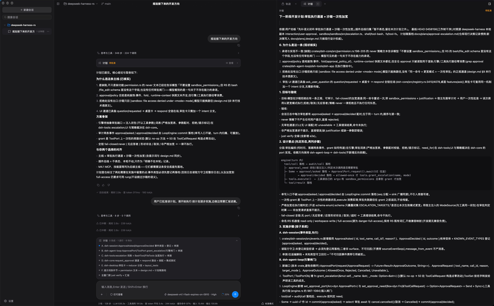

# deepseek-harness-rs

Rust + WASM Component Agent Harness——以事件日志为唯一事实源,驱动 LLM 多轮对话与工具执行;工具以 WASM 组件形态接入,在 fail-closed 沙箱中运行;附 GPUI 原生桌面客户端与 JSON-RPC stdio 网关。



## 与 DeepSeek Harness 的关系

本项目以 [DeepSeek Harness](https://github.com/deepseek-ai/deepseek-harness) 为初始蓝本:那是 DeepSeek AI 开发的开源 agent harness(TypeScript,npm 包 `@deepseek-ai/dsh`,构建于 Cordis 插件体系,附 Web UI);起步阶段的 system prompt、工具行为语义、会话事件协议与客户端交互形态参照其开发快照设计。内核原生自研:Rust 事件溯源核心、wasmtime WASM 组件工具、GPUI 桌面客户端,运行时不依赖 Node.js。

## 兼容性说明

- 兼容不是目标:不追求与 DeepSeek Harness 功能对齐,后续也不同步其演进。
- 本项目自身处于早期开发阶段(0.1.0):会话日志格式、JSON-RPC 协议、配置与 preset 格式均可能随时变更,开发期不提供迁移与向后兼容。
- 沙箱与 PTY 当前支持 macOS(Seatbelt)与 Linux(Landlock / bubblewrap);Windows 未支持。

## 特性

- **事件溯源**:会话全部状态是追加式 JSONL 事件日志;模型历史、审计、遥测均为投影,同一日志任意时刻重放结果一致,崩溃后从日志恢复。
- **结构性不变式**:「模型可见 ⟺ 已记录」由不变式闸门在唯一出网点强制,不依赖调用方自律;沙箱不可用即拒绝执行。
- **多方言 LLM 接入**:deepseek-responses(默认)/ openai-responses / anthropic / deepseek-chat / openai-chat——三个通用方言引擎(chat / responses / anthropic)加 Ext 差异点,SSE 流式、取消、重试。
- **WASM 组件工具**:接口以 WIT 契约定义(`wit/`,WASI 0.3 形状),wasmtime 运行;组件权限由能力束显式界定,时钟与随机源显式注入保证重放确定性。
- **沙箱执行**:macOS Seatbelt / Linux Landlock / bubblewrap 沙箱链(fail-closed),受控 spawn 与 PTY(独立进程组,SIGTERM→宽限→SIGKILL)。
- **内置工具面**:bash / file_read / file_edit / file_search(ripgrep 引擎)/ todo / plan / goal / 子代理(嵌套引擎、独立子日志、能力束窄化)/ 后台任务。
- **两种入口**:`dsh` CLI(单轮 / REPL / `serve` JSON-RPC stdio 网关)与 `dsh-desktop`(GPUI 桌面客户端:聊天、轨迹检查器、多会话、子代理,进程内直连核心)。
- **能力 preset**:YAML manifest 声明工具与权限面(内置 standard / minimal,工作区可扩展)。

## 快速开始

要求 Rust 1.97+(edition 2024)。

```bash
# 不联网自检(fake provider,脚本化回声)
cargo run -p dsh -- chat --fake

# 接真实 provider(缺省读 DEEPSEEK_API_KEY;--dialect 可切 anthropic / openai-chat 等)
cargo run -p dsh -- chat

# JSON-RPC stdio 网关
cargo run -p dsh -- serve

# GPUI 桌面客户端
just desktop-run        # 参数透传,如 just desktop-run --fake
```

## 验证

```bash
just verify    # 格式 / clippy / 测试 / WIT / 组件契约 / e2e / 链接检查
```

## 仓库布局

| 路径 | 职责 |
|---|---|
| `wit/` | 契约层,全部 WIT 包的唯一契约源 |
| `crates/dsh` | 宿主二进制(CLI 薄壳) |
| `crates/dsh-app` | 会话装配层(配置合并 / prompt 组装 / preset 工具组装) |
| `crates/dsh-core` | 多会话应用核心(注册表 / 客方协议类型 / 轨迹与统计投影) |
| `crates/dsh-desktop` | GPUI 桌面客户端 |
| `crates/dsh-host` | 组件宿主(wasmtime 组件管理器 / 事件总线 / 持久化 / 网关) |
| `crates/dsh-llm` | LLM 接入(方言引擎 / HTTP+SSE transport / 不变式闸门) |
| `crates/dsh-sandbox` | 执行原语(沙箱链 / 受控 spawn / PTY) |
| `crates/dsh-agent-loop` | turn/step 状态机与端口 trait |
| `crates/dsh-session` | 事件日志(信封 / seq / 消息派生,wasm32-wasip2 产物 + rlib) |
| `crates/dsh-prompt` | system prompt 组装(纯函数) |
| `crates/dsh-hooks` | hooks 桥(Claude Code / Codex shell hooks 接入) |
| `crates/dsh-tools` | 工具注册表与内置工具 |
| `crates/dsh-wit` | host 侧 bindgen 与组件契约测试 |
| `crates/dsh-example-tool` | 示例工具组件(`dsh:tools` world 参考实现) |
| `presets/` | 内置能力 preset manifest(standard / minimal) |
| `scripts/` | verify 脚本 |

## 文档

- [docs/design.md](docs/design.md) —— 设计文档(质量目标 / 架构约束 / 构件与运行视图 / 横切概念 / 术语表)
- [docs/plugin-sdk.md](docs/plugin-sdk.md) —— 插件 SDK
- [wit/](wit) —— WIT 契约定义

## 许可证

[MIT](LICENSE)
